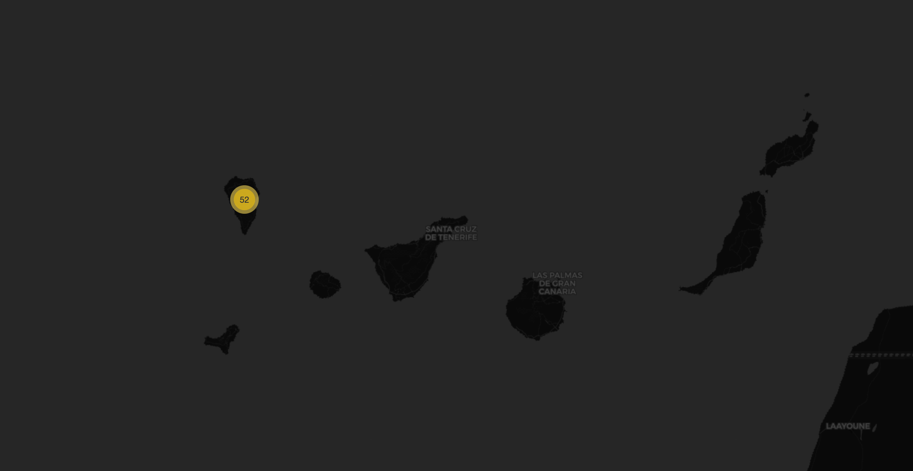
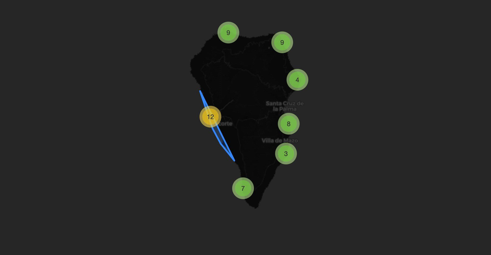

# Mapping Caves in Canary Islands

## Geographic data visualization from beautiful places in Spanish island Palma in the Canary Archipielago

First of all, data obtained from https://datos.gob.es/ needed a cleaning process by removing empty and useless columns and transforming column names.

Using Python geographic packages, every cave and singular point in Canary Islands will be represented in a map. Working with geopandas and pandas dataframe, converting UTM coordinates into longitud and latitud.

The goal is to show in a html map the interesting points from our Canary Islands database.

My hard points here were to discover that there weren't Longitud and Latitud but X and Y geographic coordinates, so I have to find a package to transform them and to be able to represent easily.

When all the data was in the right format, I used folium to represent every cave, row in the dataframe, in the map.

Adding a cluster that merges near points depending on the zoom was the final step in this project, and here it is the result in a dark mode background layer.

